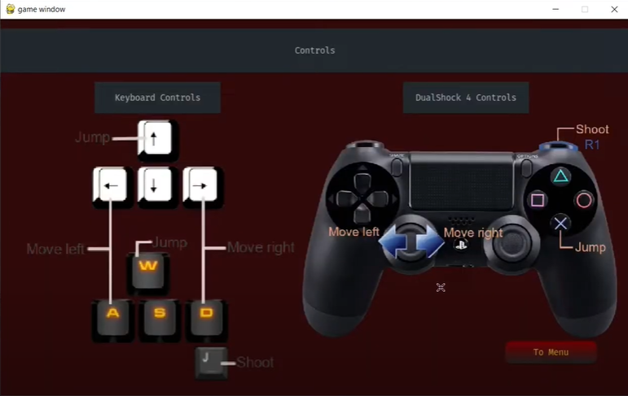
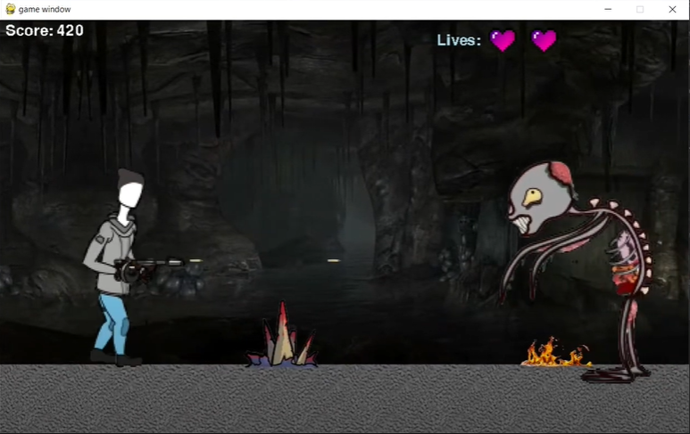

# Platformer-Game
A side-scrolling platformer game project I made as part of A-level Computer Science coursework

<!-- TABLE OF CONTENTS -->
<details>
  <summary>Table of Contents</summary>
  <ol>
    <li><a href="#about-the-project">About The Project</a></li>
    <li><a href="#set-up">Set Up</a>
      <ul>
        <li><a href="#game-installation">Game Installation</a></li>
        <li><a href="#alternative-installation-of-zip">Zip Alternative Installation</a></li>
      </ul>
    </li>
    <li><a href="#usage-guidelines">Usage Guidelines</a></li>
    <li><a href="#contact">Contact</a></li>
  </ol>
</details>


<!-- ABOUT THE PROJECT -->
## About The Project







Zombie Onslaught is a singleplayer side-scrolling platformer game. Choose between a soldier and a boy facing endless hordes of undead as you navigate a dark cavern, given only 5 lives. Manoeuvre dangerous obstacles like spikes and fire and be prepared to face bosses that take more hits than regular zombies to kill. Attempt to beat the high score but be wary as the game gets progressively more challenging as it goes on.

<!-- SETTING UP -->
## Set Up

1. **Operating System**:
   - Windows
   - MacOS

2. **System Requirements**:
   - Python
   - PyCharm (version 3 minimum)

## Game Installation

1. Clone the repository
   ```sh
   git clone https://github.com/Pie-R-Squared/Platformer-Game.git
   ```
2. Open main.py in PyCharm and run the application

## Alternative Installation of Zip

1. Download the zip file from the repository

<image src="assets/projectZipDownload.png" alt="zip" width="300"/>

Download size: approx. 100MB

2. Go to the Downloads folder and extract the file

3. Open main.py in PyCharm and run the application


<!-- USAGE EXAMPLES -->
## Usage Guidelines


After running the application, start the game by clicking on the 'Start Game' button. This image portrays the main screen of the application, and closing this or pressing the 'Quit' button will terminate the app. A series of other buttons will open other windows like customisations and controls.


The 'Customise' button opens a new window allowing you to select between a soldier character or a boy. To select a particular character, simply click on the desired image and a green rectangle will appear around the selected one. By default, the soldier is selected.


The 'Controls' button opens a window displaying a labelled diagram of keyboard controls and controller controls.


This is the main gameplay window, accessed by pressing 'Start Game' in the menu. Attempting to press esc will cause a confirmation dialog to appear. This is to prevent accidentally closing the game and losing progress. Press 'Menu' to proceed back to the main menu or press 'Cancel' to resume playing.


<!-- CONTACT -->
## Contact

Aneeka Ahmad - ahmadaneeka@outlook.com

Project Link: [https://github.com/Pie-R-Squared/HorseRaceSimulator](https://github.com/Pie-R-Squared/Platformer-Game)
